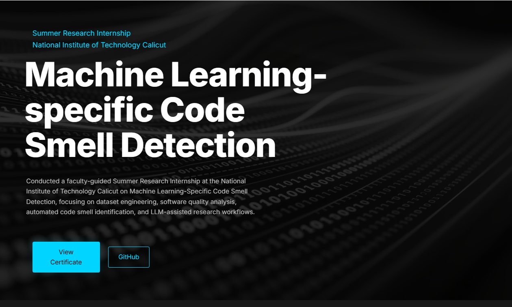
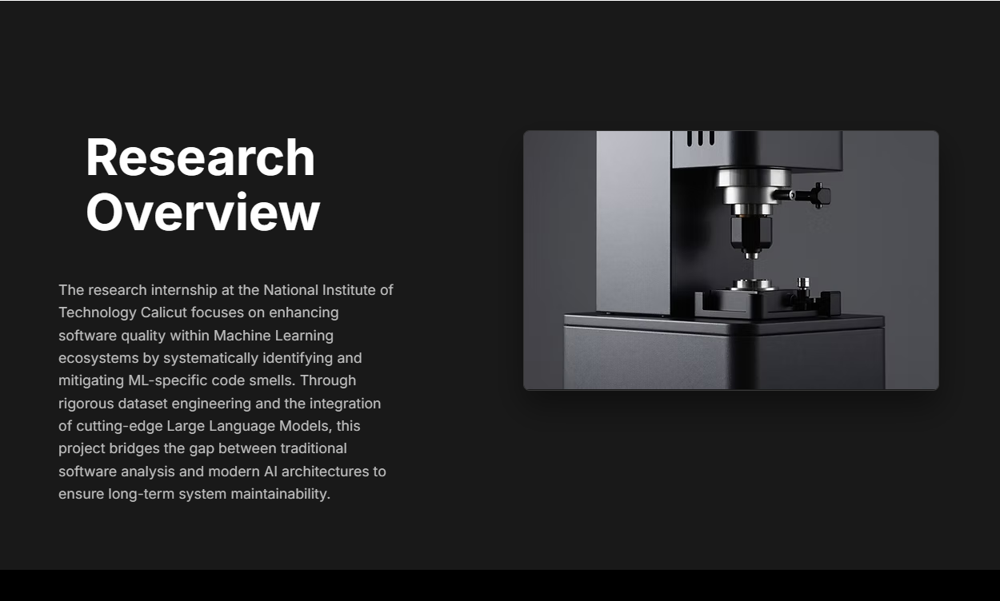
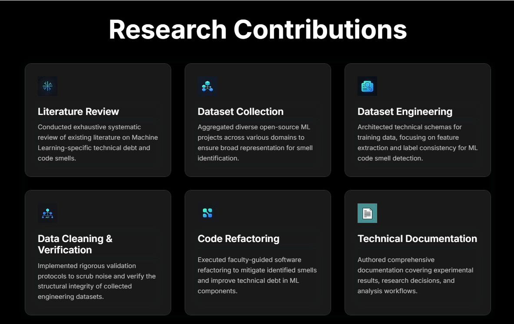
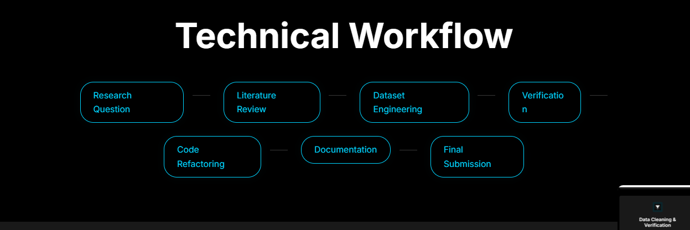
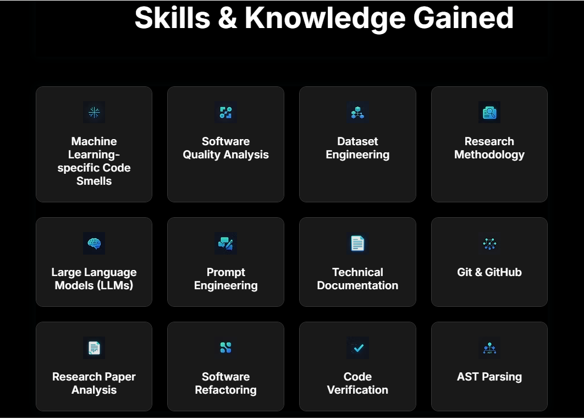
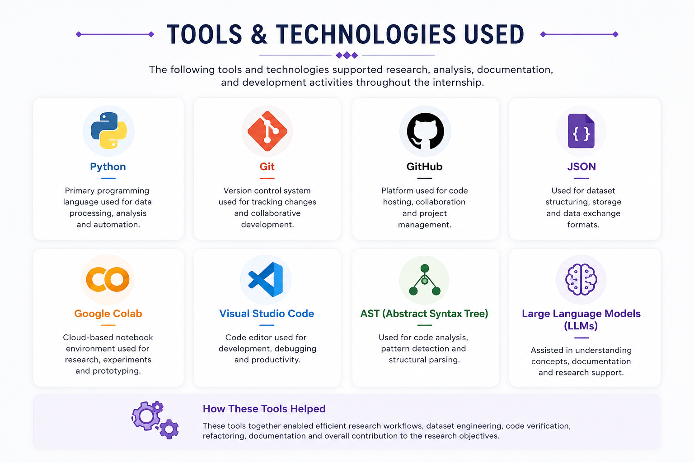
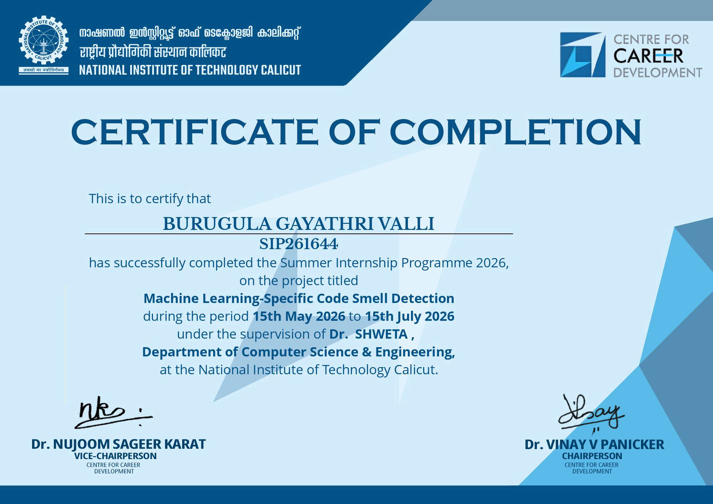

# 🧠 Machine Learning-Specific Code Smell Detection

## Summer Research Internship 2026

> **National Institute of Technology Calicut (NIT Calicut)**

**Duration:** 15 May 2026 – 15 July 2026

**Research Supervisor:** Dr. Shweta

---

## 📌 Project Overview

This repository presents a public showcase of my Summer Research Internship at the National Institute of Technology Calicut. The project focused on understanding, analyzing, and documenting Machine Learning-specific code smells to improve software quality and maintainability.

During the internship, I contributed to literature review, dataset engineering, code verification, refactoring, documentation, and research workflows.

> **Note:** This repository is intended for portfolio and educational purposes only. Confidential datasets, implementation details, and internal research artifacts are not included.

---

# 🎯 Research Objectives

- Study Machine Learning-specific code smells.
- Understand their impact on software quality.
- Assist in dataset engineering and verification.
- Explore refactoring techniques.
- Contribute to research documentation.

---

# 🔄 Research Workflow

```text
Research Problem
        │
        ▼
Literature Review
        │
        ▼
Dataset Engineering
        │
        ▼
Verification
        │
        ▼
Code Refactoring
        │
        ▼
Documentation
        │
        ▼
Final Research Deliverables
```

---

# 🛠️ Technologies Used

- Python
- Git
- GitHub
- JSON
- Abstract Syntax Tree (AST)
- Google Colab
- VS Code
- Large Language Models (LLMs)

---

# 📚 Research Contributions

During the internship, I worked on:

- Literature review
- Machine Learning code smell analysis
- Dataset engineering
- Dataset verification
- Code refactoring
- Documentation
- Research methodology

---

# 📷 Project Gallery

## Hero Section



---

## Research Overview



---

## Research Contributions



---

## Workflow



---

## Skills



---

## Technology Stack



---

# 📂 Repository Structure

```text
Machine-Learning-Code-Smell-Detection

│── README.md
│── LICENSE

├── docs
│     Project_Overview.pdf

├── images
│     hero.png
│     overview.png
│     contributions.png
│     workflow.png
│     skills.png
│     technology.png
│     certificate.jpg

├── samples
│     sample_dataset.json
│     sample_refactoring.py
│     sample_verification.py
```

---

# 💻 Sample Files

The **samples** directory contains simple educational examples that demonstrate concepts related to the internship. These examples are not part of the original research implementation.

---

# 📜 Internship Certificate



---

# 🚀 Future Scope

- Extend support for additional Machine Learning code smells.
- Improve automated detection techniques.
- Explore AI-assisted refactoring.
- Expand dataset quality and coverage.

---

# 🙏 Acknowledgements

I sincerely thank **Dr. Shweta**, Department of Computer Science and Engineering, National Institute of Technology Calicut, for her valuable guidance throughout the Summer Research Internship.

I am also grateful to NIT Calicut for providing the opportunity to work on an exciting software engineering research project.

---

## 📄 Disclaimer

This repository is intended solely to showcase my internship experience. All confidential datasets, implementation details, and internal research materials have been excluded to respect research ethics and institutional guidelines.
